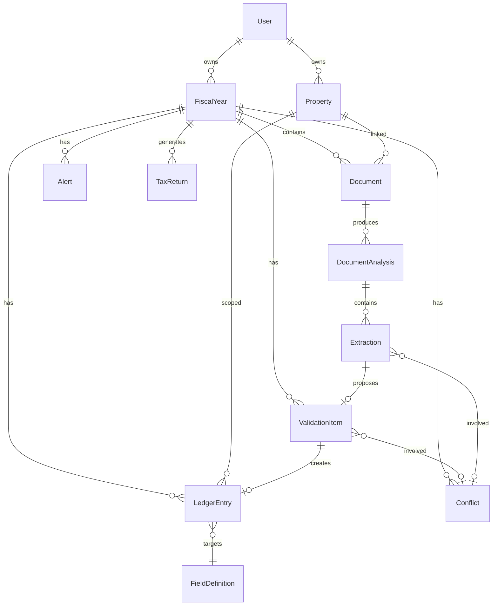
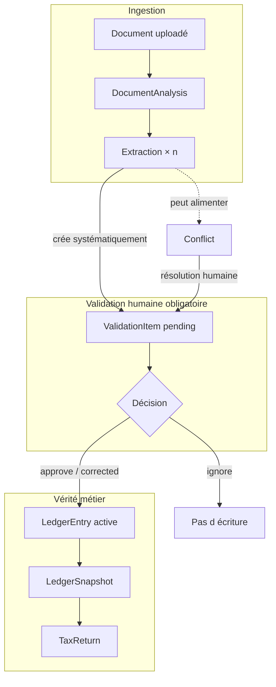
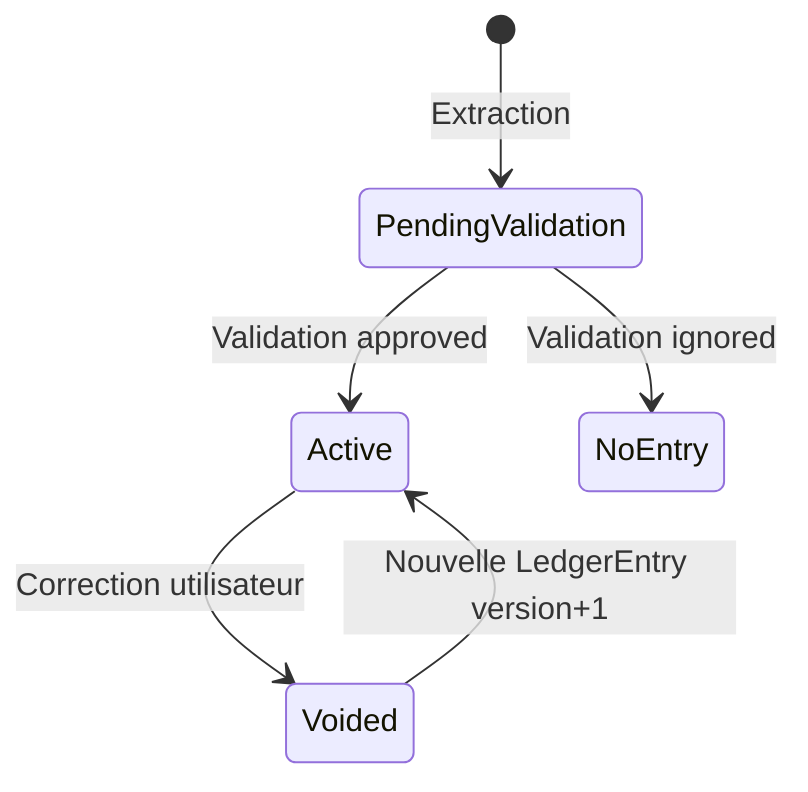
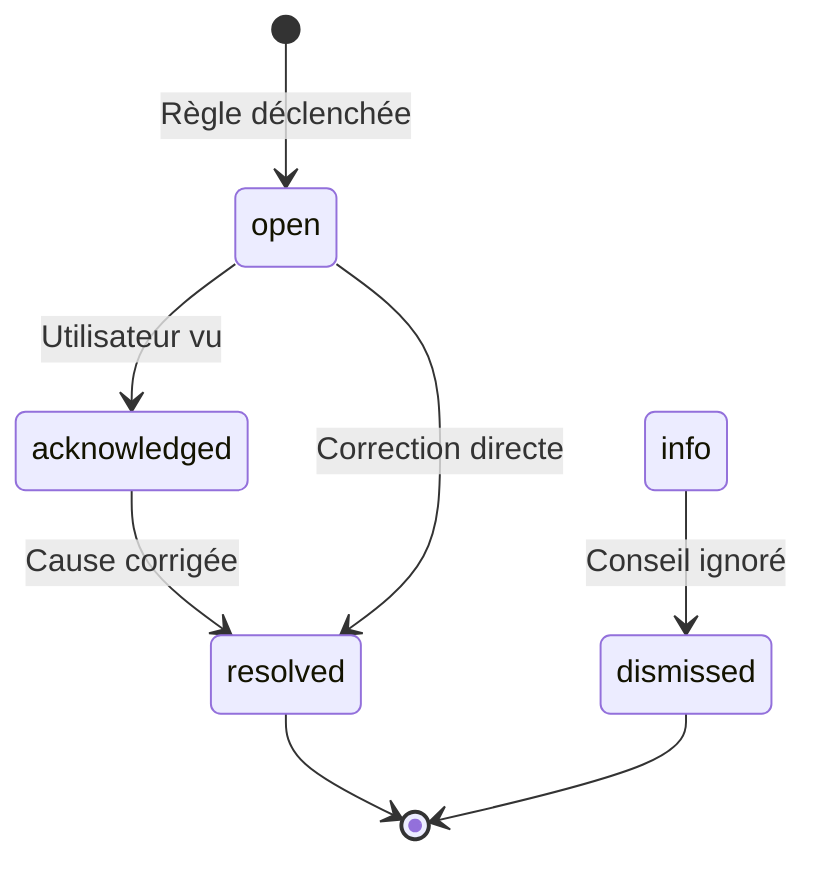
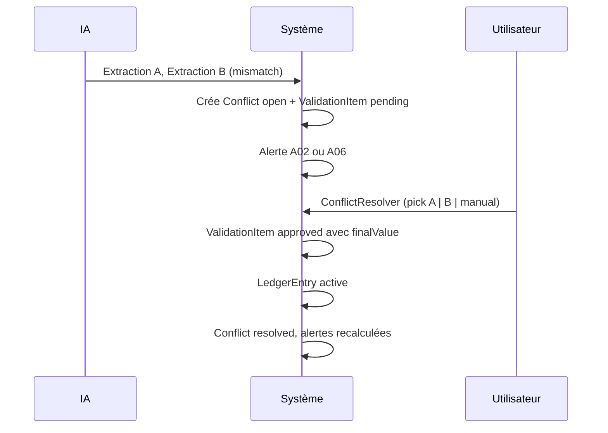

# Modèle de données LMNP — Fiscal AI

> **Version** : 1.0  
> **Aligné avec** : [WIREFRAMES-LMNP.md](./WIREFRAMES-LMNP.md)  
> **Principe fondateur** : copilote IA fiscal — **aucune donnée fiscale chiffrée n’entre dans le dossier officiel sans validation humaine explicite.**

---

## 1. Principes d’architecture

### 1.1 Règle d’or : validation humaine obligatoire

```
Document → Analyse IA → Extraction (proposition)
                              ↓
                      ValidationItem (pending)
                              ↓
                   [Humain : approuve | corrige | ignore]
                              ↓
                      Écriture métier (approved)
                              ↓
                      Liasse / totaux fiscaux
```

| Couche | Rôle | Fait foi pour la liasse ? |
|--------|------|---------------------------|
| **Document** | Preuve brute, stockage, OCR | Non (support probant) |
| **Extraction** | Proposition IA structurée | **Non** |
| **ValidationItem** | Décision humaine en attente ou passée | Oui, une fois `approved` |
| **Écriture** (`LedgerEntry`) | Fait métier validé, versionné | **Oui** |
| **Liasse** (`TaxReturn`) | Agrégat dérivé des écritures | Oui (export) |

**Interdictions produit**

- L’IA ne crée jamais d’`LedgerEntry` directement.
- Le bulk « Tout valider ≥ 95 % » reste une **action utilisateur** (batch de validations, pas d’auto-approve silencieux).
- Une `Extraction` ignorée ou rejetée ne produit pas d’écriture.
- La clôture est bloquée tant qu’existent des `ValidationItem` obligatoires en `pending` ou des alertes `blocking` ouvertes.

### 1.2 Séparation proposition / vérité

| Concept | Identifiant type | Mutabilité |
|---------|------------------|------------|
| Proposition IA | `Extraction` | Immuable après analyse (nouvelle analyse = nouvelles extractions) |
| Décision humaine | `ValidationItem` | État mutable ; historisé |
| Vérité métier | `LedgerEntry` | Append-only logique : correction = nouvelle version, pas écrasement silencieux |

### 1.3 Traçabilité

Toute `LedgerEntry` porte :

- `validationItemId` — lien vers la décision humaine
- `sourceDocumentIds[]` — pièces justificatives
- `origin` — `ai_extracted` \| `manual` \| `import_prior_year`
- `auditTrail[]` — qui, quand, quoi

---

## 2. Vue d’ensemble des entités



---

## 3. Objets métier principaux

### 3.1 Compte & profil

```typescript
interface User {
  id: string;
  email: string;
  displayName: string;
  createdAt: string; // ISO 8601
  fiscalProfile: FiscalProfile;
  subscription: "free" | "pro" | "expert";
}

interface FiscalProfile {
  /** LMNP par défaut pour ce produit */
  activityType: "lmnp";
  siret?: string;
  address?: string;
  taxNumber?: string; // SPI
  defaultRegime?: "micro-bic" | "reel";
}
```

### 3.2 Exercice fiscal (unité de travail)

```typescript
type FiscalYearStatus =
  | "draft"
  | "collecting_documents"
  | "analyzing"
  | "pending_validation"
  | "in_review"           // relecture expert optionnelle
  | "ready_to_close"
  | "closed"
  | "archived";

interface FiscalYear {
  id: string;
  userId: string;
  year: number;                    // ex. 2025
  status: FiscalYearStatus;
  regime: "micro-bic" | "reel";
  regimeConfirmedAt?: string;
  regimeConfirmedBy?: Actor;
  propertyIds: string[];
  progress: FiscalYearProgress;
  checklist: ChecklistItemState[];
  createdAt: string;
  updatedAt: string;
  closedAt?: string;
}

interface FiscalYearProgress {
  documentsPercent: number;
  validationPercent: number;
  tabsPercent: number;
  overallPercent: number;
  pendingValidationCount: number;
  blockingAlertCount: number;
}

type Actor = "user" | "expert" | "system";
```

### 3.3 Bien locatif

```typescript
interface Property {
  id: string;
  userId: string;
  label: string;                   // "T2 Lyon 6e"
  address: string;
  city: string;
  postalCode: string;
  acquisitionDate?: string;
  acquisitionPrice?: Money;
  surfaceM2?: number;
  isActive: boolean;
  createdAt: string;
}
```

### 3.4 Document

```typescript
type DocumentStatus =
  | "uploaded"
  | "processing"
  | "analyzed"
  | "failed"
  | "archived";

type DocumentCategory =
  | "bail"
  | "revenus"
  | "charges"
  | "amortissement"
  | "emprunt"
  | "fiscal"
  | "autre";

/** Granularité fine pour l’IA et la checklist */
type DocumentType =
  | "lease_contract"
  | "rent_receipt"
  | "rent_bank_statement"
  | "bank_statement"
  | "property_tax"
  | "insurance_invoice"
  | "condo_charges"
  | "works_invoice"
  | "furniture_invoice"
  | "loan_interest_certificate"
  | "loan_schedule"
  | "notary_deed"
  | "prior_year_return"
  | "unknown";

interface Document {
  id: string;
  fiscalYearId: string;
  propertyId?: string;
  fileName: string;
  mimeType: string;
  sizeBytes: number;
  storageKey: string;              // chemin objet S3 / blob
  category: DocumentCategory;
  documentType: DocumentType;
  status: DocumentStatus;
  uploadedAt: string;
  uploadedBy: Actor;
  checksum?: string;               // détection doublons
  currentAnalysisId?: string;      // dernière analyse
  isDeleted: boolean;
}
```

### 3.5 Analyse document & extraction (couche IA)

```typescript
interface DocumentAnalysis {
  id: string;
  documentId: string;
  fiscalYearId: string;
  pipelineVersion: string;         // traçabilité modèle OCR/LLM
  status: "running" | "completed" | "failed";
  startedAt: string;
  completedAt?: string;
  failureReason?: string;
  extractions: Extraction[];
  rawOcrText?: string;
}

interface Extraction {
  id: string;
  analysisId: string;
  documentId: string;
  fiscalYearId: string;
  propertyId?: string;

  /** Clé canonique du champ métier — voir § 8 */
  fieldKey: FieldKey;

  /** Valeurs */
  rawValue: string;                // texte OCR brut
  normalizedValue: NormalizedValue;
  confidence: ConfidenceScore;

  /** Localisation dans le document */
  evidence?: ExtractionEvidence;

  /** Lien vers validation — créé systématiquement pour champs fiscaux */
  validationItemId?: string;

  status: ExtractionStatus;
  createdAt: string;
}

type ExtractionStatus =
  | "pending_validation"   // défaut : en attente humain
  | "linked"               // rattaché à ValidationItem traité
  | "superseded"           // remplacé par nouvelle analyse
  | "discarded";           // doc ignoré / reclassé

interface ExtractionEvidence {
  page: number;
  boundingBox?: { x: number; y: number; w: number; h: number };
  snippet?: string;
}

type NormalizedValue =
  | { type: "money"; amountCents: number; currency: "EUR" }
  | { type: "date"; date: string }
  | { type: "text"; text: string }
  | { type: "number"; value: number }
  | { type: "boolean"; value: boolean }
  | { type: "enum"; enumKey: string };
```

### 3.6 Validation (pont humain obligatoire)

```typescript
type ValidationStatus =
  | "pending"
  | "approved"
  | "corrected"      // corrigé puis approuvé
  | "ignored"
  | "needs_document"; // en attente d’une autre PJ

interface ValidationItem {
  id: string;
  fiscalYearId: string;
  propertyId?: string;

  fieldKey: FieldKey;
  label: string;                   // libellé vulgarisé UI

  /** Proposition */
  proposedValue: NormalizedValue;
  proposedSource: ValidationSource;

  /** Décision */
  finalValue?: NormalizedValue;
  status: ValidationStatus;
  reviewedBy?: Actor;
  reviewedAt?: string;
  rejectReason?: ValidationRejectReason;
  correctionNote?: string;

  /** Obligation clôture */
  isRequired: boolean;

  /** Liens */
  extractionIds: string[];
  conflictId?: string;
  ledgerEntryId?: string;        // renseigné après approval

  createdAt: string;
  updatedAt: string;
}

interface ValidationSource {
  type: "extraction" | "manual" | "conflict_resolution";
  documentId?: string;
  extractionId?: string;
  confidence?: ConfidenceScore;
}

type ValidationRejectReason =
  | "incorrect_extraction"
  | "not_applicable_this_year"
  | "duplicate"
  | "other";
```

### 3.7 Écriture métier (vérité après validation)

> Terme UI : ligne dans Recettes, Dépenses, etc.  
> Terme modèle : **`LedgerEntry`** — ne pas confondre avec une écriture comptable PCG complète (journal / grand livre). C’est un **fait fiscal validé** rattaché à un exercice.

```typescript
type LedgerDomain =
  | "income"           // Recettes
  | "expense"          // Dépenses
  | "amortization"     // Immobilisations
  | "loan"             // Emprunts
  | "activity";        // Activité (régime, métadonnées bien)

type LedgerEntryStatus = "active" | "voided";

interface LedgerEntry {
  id: string;
  fiscalYearId: string;
  propertyId?: string;
  domain: LedgerDomain;

  fieldKey: FieldKey;
  value: NormalizedValue;

  /** Classification dépenses */
  expenseCategory?: ExpenseCategory;

  /** Traçabilité */
  validationItemId: string;
  sourceDocumentIds: string[];
  origin: "ai_extracted" | "manual" | "import_prior_year";

  status: LedgerEntryStatus;
  version: number;                 // incrémenté à chaque correction
  supersedesEntryId?: string;     // chaîne de versions

  label?: string;                 // libellé affiché (ex. "PNO MMA")
  periodStart?: string;
  periodEnd?: string;

  createdAt: string;
  createdBy: Actor;
}

type ExpenseCategory =
  | "condo"
  | "insurance"
  | "property_tax"
  | "management_fees"
  | "works_deductible"
  | "works_capitalized"
  | "other";
```

### 3.8 Liasse fiscale (agrégat dérivé)

```typescript
interface TaxReturn {
  id: string;
  fiscalYearId: string;
  version: number;
  status: "draft" | "generated" | "expert_approved" | "filed";
  forms: Record<string, FormPayload>;  // "2031", "2033", …
  summary: TaxReturnSummary;
  generatedAt: string;
  generatedFromLedgerSnapshotId: string;
  expertApprovedAt?: string;
  expertApprovedBy?: string;
}

interface TaxReturnSummary {
  grossIncomeCents: number;
  totalDeductionsCents: number;
  amortizationCents: number;
  netIncomeCents: number;
  estimatedTaxCents?: number;
}

/** Snapshot figé des LedgerEntry actives au moment de la génération */
interface LedgerSnapshot {
  id: string;
  fiscalYearId: string;
  entryIds: string[];
  createdAt: string;
}
```

### 3.9 Alerte

```typescript
type AlertSeverity = "blocking" | "warning" | "info";

type AlertStatus = "open" | "acknowledged" | "resolved" | "dismissed";

type AlertCode =
  | "A01_LOW_CONFIDENCE"
  | "A02_SOURCE_MISMATCH"
  | "A03_MISSING_RECEIPT"
  | "A04_REQUIRED_DOCUMENT_MISSING"
  | "A05_LOAN_INTEREST_WITHOUT_CERTIFICATE"
  | "A06_UNRESOLVED_CONFLICT"
  | "A07_PENDING_REQUIRED_VALIDATION"
  | "A08_REGIME_SUBOPTIMAL"
  | "A09_DOCUMENT_ANALYSIS_FAILED"
  | "A10_DUPLICATE_DOCUMENT"
  | "A11_REQUIRED_FIELD_EMPTY"
  | "A12_ORPHAN_EXTRACTION";

interface Alert {
  id: string;
  fiscalYearId: string;
  code: AlertCode;
  severity: AlertSeverity;
  status: AlertStatus;

  title: string;
  message: string;
  impact?: string;                 // "Bloque la clôture"

  /** Rattachements pour résolution */
  fieldKey?: FieldKey;
  documentId?: string;
  validationItemId?: string;
  conflictId?: string;
  ledgerEntryId?: string;

  /** Actions suggérées (IDs routes / modales) */
  primaryAction?: AlertAction;
  secondaryAction?: AlertAction;

  createdAt: string;
  resolvedAt?: string;
  resolvedBy?: Actor;
  resolutionNote?: string;
}

interface AlertAction {
  type: "navigate" | "upload" | "validate" | "correct" | "dismiss";
  target: string;
  label: string;
}
```

### 3.10 Conflit

```typescript
type ConflictStatus = "open" | "resolved" | "dismissed";

type ConflictResolutionStrategy =
  | "pick_source_a"
  | "pick_source_b"
  | "manual_value"
  | "dismiss_with_note";

interface Conflict {
  id: string;
  fiscalYearId: string;
  fieldKey: FieldKey;
  status: ConflictStatus;

  /** Candidats (extractions ou écritures proposées) */
  candidates: ConflictCandidate[];

  /** Résolution */
  resolution?: {
    strategy: ConflictResolutionStrategy;
    chosenCandidateId?: string;
    manualValue?: NormalizedValue;
    note?: string;
    resolvedBy: Actor;
    resolvedAt: string;
    validationItemId: string;    // ValidationItem créé/mis à jour
  };

  createdAt: string;
  updatedAt: string;
}

interface ConflictCandidate {
  id: string;
  sourceType: "extraction" | "ledger_entry" | "manual";
  sourceId: string;
  documentId?: string;
  value: NormalizedValue;
  confidence?: ConfidenceScore;
  label: string;                   // ex. "releve_banque.pdf"
}
```

### 3.11 Assistant (hors vérité fiscale)

```typescript
interface ChatThread {
  id: string;
  fiscalYearId: string;
  messages: ChatMessage[];
  contextSnapshot: CopilotContext;
}

interface CopilotContext {
  currentRoute: string;
  fiscalYearStatus: FiscalYearStatus;
  pendingValidationCount: number;
  openAlertCodes: AlertCode[];
  /** Le copilote ne lit pas les valeurs non validées comme des faits */
  validatedSummary?: Partial<Record<FieldKey, NormalizedValue>>;
}

interface ChatMessage {
  id: string;
  role: "user" | "assistant";
  content: string;
  timestamp: string;
  relatedEntityIds?: string[];
}
```

### 3.12 Checklist documentaire

```typescript
interface ChecklistItemDefinition {
  id: string;
  documentType: DocumentType;
  requiredForRegime: ("micro-bic" | "reel")[];
  label: string;
}

interface ChecklistItemState {
  definitionId: string;
  status: "missing" | "uploaded" | "not_applicable";
  documentIds: string[];
  notApplicableReason?: string;
  markedBy?: Actor;
  markedAt?: string;
}
```

---

## 4. Relations : documents, extractions, validations, écritures

### 4.1 Diagramme de flux



### 4.2 Règles de cardinalité

| Relation | Cardinalité | Règle |
|----------|-------------|-------|
| Document → DocumentAnalysis | 1 → N | Nouvelle analyse si re-traitement ; anciennes extractions → `superseded` |
| DocumentAnalysis → Extraction | 1 → N | — |
| Extraction → ValidationItem | N → 1 | Plusieurs extractions peuvent alimenter **un** item (agrégation) ou **un** item par extraction selon `fieldKey` |
| ValidationItem → LedgerEntry | 1 → 0..1 | Créée **uniquement** à `approved` / `corrected` |
| ValidationItem → Extraction | 1 → N | `extractionIds[]` |
| LedgerEntry → Document | N → M | `sourceDocumentIds[]` |
| Conflict → Extraction | 1 → 2+ | Même `fieldKey`, valeurs incompatibles |
| Conflict → ValidationItem | 1 → 1 | Après résolution |

### 4.3 Création des ValidationItem

| Déclencheur | Comportement |
|-------------|--------------|
| Extraction sur champ fiscal (`fieldKey` dans registre § 8) | Créer `ValidationItem` en `pending` |
| Saisie manuelle utilisateur | Créer `ValidationItem` + auto-`approved` par l’utilisateur + `LedgerEntry` |
| Résolution conflit | Mettre à jour / créer `ValidationItem` puis `LedgerEntry` |
| Bulk validate ≥ 95 % | Plusieurs `pending` → `approved` en batch **par clic utilisateur** |

**Registre des champs sans ValidationItem** (ne impactent pas la liasse) :

- Métadonnées fichier (nom, taille)
- Texte OCR brut
- Messages copilote

### 4.4 Cycle de vie d’une écriture



**Correction** : ne pas muter `LedgerEntry` en place.

1. `status = voided` sur l’ancienne entrée  
2. Nouvelle `ValidationItem` (ou réouverture) avec `corrected`  
3. Nouvelle `LedgerEntry` avec `version + 1`, `supersedesEntryId`  

---

## 5. Niveaux de confiance IA

### 5.1 Score

```typescript
/** Entier 0–100 ou float 0–1 — stockage recommandé : entier 0–100 */
type ConfidenceScore = number;

interface ConfidenceMeta {
  score: ConfidenceScore;
  band: ConfidenceBand;
  reasons: ConfidenceReason[];
}

type ConfidenceBand = "high" | "medium" | "low";

type ConfidenceReason =
  | "clear_ocr"
  | "blurry_scan"
  | "multiple_amounts_on_page"
  | "ambiguous_document_type"
  | "field_not_found"
  | "cross_field_inconsistent"
  | "model_low_logprob";
```

### 5.2 Seuils produit (alignés wireframes)

| Bande | Plage | UI | Comportement |
|-------|-------|-----|--------------|
| **high** | ≥ 95 | ✅ discret | Éligible au bulk « Tout valider ≥ 95 % » |
| **medium** | 85 – 94 | 🟡 | Validation inbox ; pas de bulk |
| **low** | < 85 | 🟡 prioritaire | Alerte `A01` ; tri prioritaire inbox |

### 5.3 Confiance ≠ vérité

| Affirmation | Correct |
|-------------|---------|
| Confiance 99 % = montant juste | **Non** — toujours `pending` jusqu’à validation |
| Confiance 60 % = montant faux | **Non** — peut être juste ; nécessite vérification |
| Après validation humaine | La confiance IA devient **historique** ; fait foi `finalValue` |

### 5.4 Agrégation multi-extractions

Si plusieurs extractions alimentent un même `ValidationItem` :

```
displayConfidence = min(extraction.confidence)   // prudent
```

---

## 6. Alertes — catalogue & génération

### 6.1 Matrice alertes

| Code | Sévérité | Déclencheur | Bloque clôture | Résolution typique |
|------|----------|-------------|----------------|-------------------|
| A01 | warning | `confidence < 85` sur ValidationItem pending | Non | Valider / corriger |
| A02 | warning | 2+ sources, écart > seuil (§ 7) | Non* | ConflictResolver |
| A03 | warning | LedgerEntry expense sans `documentId` | Non | Upload PJ |
| A04 | blocking | Checklist indispensable non satisfaite | **Oui** | Upload ou NA justifié |
| A05 | blocking | `loan.annualInterest` > 0 sans certificat | **Oui** | Upload attestation |
| A06 | blocking | `Conflict.status === open` | **Oui** | Résolution conflit |
| A07 | warning | ValidationItem required en pending | Oui si required | Validation |
| A08 | info | Heuristique régime sous-optimal | Non | Dismiss / comparer |
| A09 | warning | `Document.status === failed` | Non | Re-upload |
| A10 | warning | `checksum` doublon | Non | Archiver doublon |
| A11 | blocking | Champ obligatoire sans LedgerEntry active | **Oui** | Saisie + validation |
| A12 | warning | Extraction sans ValidationItem (bug pipeline) | Non | Job correctif |

\* A02 devient **blocking** si le champ est obligatoire et le conflit reste ouvert à la clôture.

### 6.2 Recalcul des alertes

Événements déclencheurs :

- Fin d’analyse document  
- Changement `ValidationItem.status`  
- Création / void `LedgerEntry`  
- Résolution `Conflict`  
- Marquage checklist NA  
- Changement régime

**Implémentation** : fonction idempotente `recomputeAlerts(fiscalYearId)` — pas d’alertes orphelines après résolution.

### 6.3 Cycle de vie



---

## 7. Conflits possibles

### 7.1 Définition

Un **conflit** existe lorsque, pour un même `(fiscalYearId, fieldKey, propertyId?)`, au moins deux **candidats** ont des valeurs normalisées **incompatibles** au-delà du seuil de tolérance.

### 7.2 Seuils d’incompatibilité

```typescript
interface ConflictThresholds {
  moneyPercentGap: number;      // default 0.03 (3 %)
  moneyAbsoluteGapCents: number; // default 20000 (200 €)
  dateDaysGap: number;          // default 0 (dates doivent matcher)
}

function isMoneyConflict(a: number, b: number, t: ConflictThresholds): boolean {
  const gap = Math.abs(a - b);
  const pct = gap / Math.max(Math.abs(a), Math.abs(b), 1);
  return gap > t.moneyAbsoluteGapCents || pct > t.moneyPercentGap;
}
```

### 7.3 Scénarios métier courants

| Scénario | fieldKey | Candidats typiques |
|----------|----------|-------------------|
| Loyers banque vs bail | `income.annualRent` | `rent_bank_statement` vs `lease_contract` |
| Taxe foncière avis vs saisie antérieure | `expense.propertyTax` | 2 factures ou extraction vs ledger N-1 import |
| Intérêts attestation vs tableau | `loan.annualInterest` | `loan_interest_certificate` vs `loan_schedule` |
| Mobilier somme factures vs ligne unique | `amort.furnitureAnnual` | plusieurs `furniture_invoice` vs agrégat |
| Surface acte vs déclaration | `property.surfaceM2` | `notary_deed` vs saisie manuelle |

### 7.4 Résolution → vérité



**Règle** : la résolution de conflit **ne choisit jamais automatiquement** le candidat à plus haute confiance.

---

## 8. Registre des champs (`fieldKey`)

Clé canonique : `domain.field` ou `domain.subdomain.field`.

### 8.1 Activité & bien

| fieldKey | Type | Required (réel) | Domaine ledger |
|----------|------|-----------------|----------------|
| `fiscal.regime` | enum | Oui | activity |
| `property.address` | text | Oui | activity |
| `property.acquisitionPrice` | money | Non | activity |
| `property.surfaceM2` | number | Non | activity |

### 8.2 Recettes

| fieldKey | Type | Required | Domaine |
|----------|------|----------|---------|
| `income.annualRent` | money | Oui | income |
| `income.refactoredCharges` | money | Non | income |
| `income.other` | money | Non | income |

### 8.3 Dépenses

| fieldKey | Type | Required | expenseCategory |
|----------|------|----------|-----------------|
| `expense.propertyTax` | money | Oui* | property_tax |
| `expense.insurance` | money | Non | insurance |
| `expense.condo` | money | Non | condo |
| `expense.worksDeductible` | money | Non | works_deductible |
| `expense.managementFees` | money | Non | management_fees |

\* Ou `not_applicable` checklist explicite.

### 8.4 Immobilisations & emprunts

| fieldKey | Type | Required |
|----------|------|----------|
| `amort.buildingAnnual` | money | Oui (réel) |
| `amort.furnitureAnnual` | money | Non |
| `loan.annualInterest` | money | Si prêt |

---

## 9. Sources de vérité

### 9.1 Hiérarchie (ordre décroissant)

```
1. LedgerEntry active (validée par humain)
      ↑ créée depuis
2. ValidationItem (approved | corrected) + finalValue
      ↑ décision sur
3. Extraction(s) + Document(s) — preuve et proposition uniquement
      ↑
4. Inférences IA non structurées (chat, tips) — jamais source fiscale
```

### 9.2 Par type de donnée

| Donnée | Source de vérité | Fallback |
|--------|------------------|----------|
| Montant déclaré | `LedgerEntry.value` | — |
| Justificatif | `Document` référencé par écriture | Alerte A03 |
| Régime fiscal | `FiscalYear.regime` après `regimeConfirmedAt` | — |
| Totaux liasse | `TaxReturn` généré depuis `LedgerSnapshot` | Regénérer |
| Checklist pièces | `ChecklistItemState` + documents liés | Alerte A04 |
| Texte explicatif copilote | LLM + docs **validés** uniquement | Disclaimer |

### 9.3 Ce que l’IA peut afficher sans valider

| Autorisé en UI | Interdit pour calcul liasse |
|--------------|----------------------------|
| Propositions dans ValidationItem | Écriture directe |
| Simulation « si vous validez X » | Total officiel |
| Comparaison micro vs réel sur **hypothèses** | Résultat définitif sans badge *simulation* |
| Liste docs manquants (checklist) | Marquer checklist satisfied sans upload/NA |

### 9.4 Snapshot & immutabilité clôture

À la génération `TaxReturn` :

1. Créer `LedgerSnapshot` = liste des `LedgerEntry` où `status === active`  
2. Calculer formulaires depuis le snapshot uniquement  
3. Incrémenter `TaxReturn.version`  
4. Passer `FiscalYear.status` → `closed` (ou `ready` si brouillon autorisé)

**Rouvrir le dossier** : nouveau snapshot à la regénération ; anciennes versions `TaxReturn` conservées.

---

## 10. Invariants système (tests & revue)

| ID | Invariant |
|----|-----------|
| INV-01 | Aucune `LedgerEntry` sans `validationItemId` |
| INV-02 | Aucune `LedgerEntry` active avec `ValidationItem.status !== approved/corrected` |
| INV-03 | `TaxReturn` ne lit que `LedgerSnapshot`, jamais `Extraction` directement |
| INV-04 | Clôture impossible si ∃ `ValidationItem` required en `pending` |
| INV-05 | Clôture impossible si ∃ `Alert` blocking en `open` |
| INV-06 | Clôture impossible si ∃ `Conflict` en `open` |
| INV-07 | Toute `Extraction` fiscale a un `validationItemId` (sauf `discarded`) |
| INV-08 | Correction = void ancienne entrée + nouvelle version, jamais mutation silencieuse |
| INV-09 | `finalValue` défini pour tout `ValidationItem` approved/corrected |
| INV-10 | Copilote / API lecture liasse : uniquement champs validés ou snapshot |

---

## 11. Mapping code existant → cible

| Actuel (`src/.../types.ts`) | Cible |
|-----------------------------|--------|
| `UploadedDocument` | `Document` |
| `OcrExtractedField` | `Extraction` (partiel — ajouter `fieldKey`, `evidence`) |
| `PropertyFormData` | Champs `property.*` + `LedgerEntry` / `ValidationItem` |
| `DocumentCategory` | Conservé + `DocumentType` |
| `ChatMessage` | Inchangé dans `ChatThread` |

**Prochain fichier types suggéré** : `src/lib/lmnp/types.ts` (ou `packages/domain/lmnp/`) implémentant ce modèle.

---

## 12. Exemple bout-en-bout (narratif)

1. L’utilisateur upload `facture_pno.pdf` → `Document` status `uploaded`.  
2. Pipeline → `DocumentAnalysis` + `Extraction` :  
   - `fieldKey = expense.insurance`  
   - `normalizedValue = 14200` centimes  
   - `confidence = 78`  
3. Système crée `ValidationItem` pending, alerte `A01`.  
4. L’utilisateur corrige à 13800 → `status = corrected`, `finalValue = 13800`.  
5. Système crée `LedgerEntry` :  
   - `domain = expense`, `expenseCategory = insurance`  
   - `validationItemId`, `sourceDocumentIds = [doc]`  
   - `origin = ai_extracted`, `version = 1`  
6. `recomputeAlerts` → A01 résolue ; si PJ OK, pas d’A03.  
7. À la clôture, `LedgerSnapshot` inclut cette écriture ; `TaxReturn` reflète le total charges.

---

## 13. Index & identifiants (implémentation DB)

| Entité | Clé primaire | Index recommandés |
|--------|--------------|-------------------|
| FiscalYear | `id` | `(userId, year)` unique |
| Document | `id` | `(fiscalYearId)`, `(checksum)` |
| ValidationItem | `id` | `(fiscalYearId, status)`, `(fieldKey)` |
| LedgerEntry | `id` | `(fiscalYearId, fieldKey, status)`, `(propertyId)` |
| Alert | `id` | `(fiscalYearId, status, severity)` |
| Conflict | `id` | `(fiscalYearId, status)` |

---

*Document vivant — toute évolution des seuils de confiance ou des champs obligatoires doit mettre à jour les invariants § 10 et les wireframes associés.*
