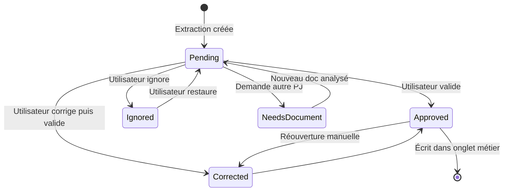

# Wireframes LMNP — Fiscal AI

> **Version** : 1.0 · **Public** : investisseurs LMNP non comptables  
> **Objectif produit** : copilote comptable rassurant — l’IA propose, l’utilisateur valide, la correction manuelle est possible partout.

---

## Principes UX (non négociables)

| Principe | Application concrète |
|----------|----------------------|
| **Une action à la fois** | Carte « Prochaine action » sur le dashboard ; mode focus dans la validation |
| **Langage investisseur, pas comptable** | « Dépenses » plutôt que « charges déductibles BIC » ; info-bulles pour le jargon obligatoire |
| **Traçabilité visible** | Chaque montant IA affiche : document source · confiance · statut (à valider / validé / corrigé) |
| **Correction partout** | Tout champ pré-rempli a : Valider · Corriger · Ignorer · Voir source |
| **Pas de surprise à la clôture** | Verrou de qualité progressif ; alertes bloquantes visibles tôt |
| **Copilote, pas juge** | Ton bienveillant ; jamais « Erreur » seul → « À vérifier ensemble » |

### Légende des wireframes

- `[Zone]` = bloc UI nommé
- `→` = action utilisateur
- *italique* = microcopy affichée
- `(état)` = variante d’affichage
- `🤖` = valeur IA · `✅` = validé · `🟡` = à valider · `✎` = saisi/corrigé par l’utilisateur · `🔴` = bloquant

### Statuts dossier (bandeau header)

`Brouillon` → `Documents en cours` → `Analyse en cours` → `À valider` → `En relecture` → `Prêt à clôturer` → `Clôturé`

---

## Shell applicatif (layout global)

Toutes les pages authentifiées partagent ce squelette.

### Layout

```
┌──────────────────────────────────────────────────────────────────────────────┐
│ [HeaderApp]  64px fixe                                                        │
├──────────────┬───────────────────────────────────────────────┬─────────────────┤
│              │ [BreadcrumbBar]  40px                        │                 │
│ [SidebarNav] │───────────────────────────────────────────────│ [CopilotPanel]  │
│  240px       │                                               │  320px          │
│  repliable   │ [PageHeader]  80–120px                        │  repliable      │
│              │───────────────────────────────────────────────│                 │
│              │ [AlertStrip]  0–48px (si alertes)             │                 │
│              │───────────────────────────────────────────────│                 │
│              │ [MainContent]  flex-1                         │                 │
│              │                                               │                 │
│              │ [PageFooter]  optionnel                       │                 │
└──────────────┴───────────────────────────────────────────────┴─────────────────┘
```

### Zones principales

| Zone | Rôle |
|------|------|
| **HeaderApp** | Exercice actif, progression globale, notifications, profil |
| **SidebarNav** | Navigation persistante + checklist résumée |
| **BreadcrumbBar** | Orientation : Exercices > 2025 > … |
| **PageHeader** | Titre page, sous-titre rassurant, CTA principal |
| **AlertStrip** | 0–2 alertes max ; lien « Voir tout » si plus |
| **MainContent** | Contenu de l’écran |
| **CopilotPanel** | Assistant IA + insights contextuels |

### Composants visibles (shell)

- `Logo` + lien accueil app
- `ExerciseSwitcher` — dropdown exercice (2024, 2025…)
- `GlobalProgressRing` — % complétion dossier
- `NotificationBell` + badge count
- `UserMenu`
- `SidebarNav` avec items + badges (`8` sur Validation)
- `ChecklistMini` — 3 lignes max dans la sidebar
- `CopilotPanel` / `CopilotFAB` (mobile)

### Interactions

| Action | Résultat |
|--------|----------|
| → Changer exercice | Recharge contexte ; conserve route si applicable |
| → Replier sidebar | Mode icônes ; plus d’espace tableau |
| → Replier copilote | FAB flottant bas-droite |
| → Clic cloche | Drawer notifications |
| → Clic alerte strip | Scroll ou navigation vers résolution |

### Messages IA (shell — toujours disponibles)

```
Bonjour ! Vous êtes sur [page]. [1 phrase contexte].
[Suggestion primaire — bouton]
[Suggestion secondaire — lien]
```

Exemples par page :

| Page | Message copilote |
|------|------------------|
| Dashboard | « Votre priorité : valider 3 montants dans Dépenses. Je vous guide ? » |
| Documents | « Vous pouvez tout déposer d’un coup — je classerai pour vous. » |
| Validation | « On vérifie ensemble 8 éléments — environ 12 minutes. » |
| Clôture | « Plus qu’une alerte bloquante avant de générer votre liasse. » |

---

## Navigation (arborescence app)

```
/app                          → Dashboard
/app/exercices/[id]           → Hub (redirige vers Activité)
/app/exercices/[id]/activite
/app/exercices/[id]/recettes
/app/exercices/[id]/depenses
/app/exercices/[id]/immobilisations
/app/exercices/[id]/emprunts
/app/exercices/[id]/cloture
/app/exercices/[id]/documents
/app/exercices/[id]/validation
/app/exercices/[id]/alertes
```

---

# Écran 1 — Dashboard principal

**Route** : `/app`  
**But** : répondre en 5 s à « Où j’en suis ? » et « Que faire maintenant ? »

## Layout

```
[PageHeader — pleine largeur]
[NextActionHero — pleine largeur, priorité visuelle #1]
[Grid 2 cols desktop]
  ├─ [ExerciseCards]
  └─ [HealthPanel]
[Grid 2 cols]
  ├─ [TaxEstimateCard]
  └─ [PropertyCards]
[ActivityFeed — pleine largeur]
[TrustBanner — pleine largeur, discret]
```

## Zones principales

### PageHeader

```
Bonjour, {prénom} 👋
Votre déclaration LMNP {année} — {progress}% complétée
*Prochaine échéance indicative : {date} — à titre informatif*
```

### NextActionHero (composant le plus important)

Affiche **une seule** action prioritaire, calculée par :

1. Alertes 🔴 bloquantes
2. Items validation 🟡 en attente
3. Documents manquants indispensables
4. Onglets métier incomplets
5. Invitation clôture

### HealthPanel

4 lignes statut : Documents · Analyse IA · Saisie · Clôture

### TaxEstimateCard

Chiffres en lecture seule + disclaimer *« Simulation — en cours de validation »*

## Composants visibles

| Composant | Props / contenu clé |
|-----------|---------------------|
| `NextActionHero` | `title`, `description`, `ctaPrimary`, `estimatedMinutes`, `lastActivityAt` |
| `ExerciseCard` | `year`, `status`, `progress`, `cta` |
| `HealthRow` | `label`, `icon`, `status`: ok \| warning \| pending \| locked |
| `TaxEstimateCard` | `regime`, `income`, `deductions`, `result`, `disclaimer` |
| `PropertyCard` | `label`, `rentTotal`, `documentCount` |
| `ActivityFeedItem` | `type`, `message`, `timestamp`, `link` |
| `TrustBanner` | texte RGPD + « Vous validez, l’IA propose » |

## Interactions

| Gesture | Comportement |
|---------|--------------|
| → CTA hero | Deep link vers écran de résolution (validation, upload, alerte…) |
| → Continuer exercice | `/app/exercices/[id]/activite` ou dernière page visitée |
| → Comparer régimes | Modale simulation micro vs réel |
| → Voir alertes | `/app/exercices/[id]/alertes` |
| → Ajouter bien | Modale création bien (minimal : label + adresse) |

## Messages IA

**CopilotPanel (dashboard)**

```
Bonjour {prénom} !

📌 Priorité du jour
{nextActionTitle}

💡 Le saviez-vous ?
{tipDuJour — 1 phrase LMNP vulgarisée}

[Guider pas à pas]
[Quels documents me manquent ?]
```

**Insights proactifs** (max 2 dans le panneau)

- « 3 montants attendent votre validation — la plupart prennent moins d’une minute chacun. »
- « Votre attestation d’intérêts 2025 manque — sans elle, la clôture restera bloquée. »

## Alertes

| Type | Affichage dashboard |
|------|---------------------|
| 🔴 Bloquant | `AlertStrip` rouge + badge sidebar Clôture |
| 🟡 À vérifier | Compteur dans `HealthPanel` + lien |
| 💡 Conseil | Uniquement copilote (pas de strip) |

## Workflow de validation (lien)

Hero pointe vers `/validation` si `pendingValidationCount > 0`.

## États

| État | UI |
|------|-----|
| Premier visite | Hero « Créer ma déclaration {année} » + illustration checklist vide |
| Aucun document | Hero « Ajoutez vos premières pièces » → Documents |
| Tout validé | Hero vert « Prêt pour la clôture » → Clôture |
| Exercice clôturé | Hero grisé « Dossier 2025 archivé » + télécharger PDF |

---

# Écran 2 — Documents (upload & bibliothèque)

**Route** : `/app/exercices/[id]/documents`  
**But** : déposer sans friction, voir ce qui manque, suivre l’analyse

## Layout

```
[PageHeader]
[DocumentChecklist — sticky sous header sur scroll]
[DocumentDropZone — zone principale]
[FilterBar]
[DocumentList — tableau ou cartes]
[UploadQueueDrawer] — overlay lors d’upload
[DocumentPreviewDrawer] — overlay aperçu + extraction
```

## Zones principales

### DocumentChecklist

Progression : `{uploaded}/{recommended}` pièces  
Sections : Indispensables (réel) · Recommandés · Optionnels  
Chaque ligne : statut ✅ 🟡 ⚪ + CTA `[Ajouter]` ou `[Non applicable]`

### DocumentDropZone

Zone drag-and-drop + `[Parcourir]` + *« PDF, JPG, PNG — max 20 Mo »*  
*« Envoyez tout d’un coup — nous classons pour vous. »*

### DocumentList

Colonnes : Fichier · Type · Bien · Statut analyse · Confiance · Actions

## Composants visibles

| Composant | Description |
|-----------|-------------|
| `DocumentChecklist` | Accordéon catégories + barre progression |
| `DocumentDropZone` | Drop + file picker + mobile camera |
| `DocumentCard` | Nom, icône type, badges statut |
| `DocumentStatusBadge` | uploaded \| processing \| analyzed \| failed \| to_classify |
| `ConfidenceBadge` | % avec couleur seuil |
| `UploadQueueDrawer` | Liste fichiers + barres progression |
| `AnalysisProgressPanel` | Étapes 1–4 animation |
| `DocumentPreviewDrawer` | Split PDF + extractions |
| `DocumentTypePicker` | Pour statut `to_classify` |
| `NaToggle` | « Non applicable » avec confirmation |

## Interactions

| Action | Résultat |
|--------|----------|
| → Drop fichiers | Ouvre `UploadQueueDrawer` ; upload parallèle |
| → Upload terminé | Auto-lance analyse ; toast « Analyse en cours » |
| → Clic document | Ouvre `DocumentPreviewDrawer` |
| → Choisir type (doc inconnu) | Relance mapping extractions |
| → Supprimer | Confirmation ; retire lignes liées non validées |
| → Non applicable (checklist) | Marque checklist ; peut rouvrir alerte si incohérent |
| → Réduire upload en arrière-plan | Continue analyse ; notif à la fin |

## Messages IA

**Pendant l’analyse** (`AnalysisProgressPanel`)

```
J’analyse vos documents…
✓ Lecture des fichiers
✓ Détection du type
→ Extraction des montants…
○ Pré-remplissage de votre dossier
*Vous pouvez quitter — je vous préviendrai.*
```

**Après analyse** (toast + copilote)

```
✅ 4 documents analysés — 6 informations à valider.
[Aller à la validation →]
```

**DocumentPreviewDrawer** (résumé IA)

```
J’ai lu :
• Montant : 142,00 € (confiance 78 %)
• Type : Assurance PNO
• Bien probable : T2 Lyon 6e
[Valider] [Corriger] [Ce n’est pas une charge]
```

## Alertes

| Alerte | Déclencheur |
|--------|-------------|
| 🔴 Pièce indispensable manquante | Checklist réel + pas de NA |
| 🟡 Doc non classifiable | `documentType === unknown` |
| 🟡 Analyse échouée | `status === failed` |
| 💡 Doublon probable | Hash ou nom similaire |

## Workflow de validation (sortie)

Chaque extraction `confidence >= 0.95` peut auto-créer un `ValidationItem` **ou** aller directement en onglet si politique « fast track » désactivée (recommandé : **tout passe par validation** pour la confiance utilisateur).

```
Document analysé
  → Extraction(s)
    → ValidationItem (pending)
      → Utilisateur valide
        → Ligne métier (Recettes / Dépenses / …)
```

## États liste

| Filtre | Contenu |
|--------|---------|
| Tous | — |
| À analyser | processing |
| Analysés | analyzed |
| À classer | to_classify |
| Validés | toutes extractions accepted |

---

# Écran 3 — Validation IA (inbox)

**Route** : `/app/exercices/[id]/validation`  
**But** : file de travail rapide — décision binaire rassurante avec sortie correction

**C’est l’écran le plus critique pour la perception « copilote ».**

## Layout (desktop)

**Mode liste** (défaut tablette/desktop)

```
[PageHeader + stats]
[BulkActionsBar]
[FilterChips]
[ValidationCard] × n
```

**Mode focus** (défaut mobile + bouton « Mode guidé » desktop)

```
[FocusHeader — 3/8]
[SplitView]
  ├─ DocumentPreview (50 %)
  └─ ValidationDecisionPanel (50 %)
[FocusProgressDots]
[StickyActionBar]
```

## Zones principales

### PageHeader

```
Validation
{pending} éléments à vérifier · ~{minutes} min estimées
*L’IA propose — vous confirmez. Rien n’est envoyé sans votre accord.*
```

### BulkActionsBar

`[Tout valider ≥ 95 % ({count})]` · Tri : Priorité \| Onglet \| Confiance  
*Visible uniquement si `highConfidenceCount > 0`*

### ValidationDecisionPanel (mode focus)

1. Titre champ vulgarisé
2. Valeur proposée (input éditable)
3. Confiance + lien source
4. Impact (« Ira dans Dépenses > Assurance »)
5. Bien rattaché (dropdown si multi)
6. Actions

## Composants visibles

| Composant | Description |
|-----------|-------------|
| `ValidationStatsBar` | pending / approved / ignored |
| `ValidationCard` | Résumé une ligne + 4 actions |
| `ValidationFocusView` | Split doc + décision |
| `ConfidenceIndicator` | Barre ou pastille colorée |
| `FieldSourceLink` | Ouvre doc à la bonne page/zone |
| `ConflictCard` | 2 sources side-by-side |
| `BulkValidateButton` | Batch ≥ seuil |
| `RejectModal` | Motifs : incorrect \| pas cette année \| autre |
| `CorrectionDrawer` | Voir écran 6 |

## Interactions — workflow de validation complet



| Action | Effet système | UI feedback |
|--------|---------------|-------------|
| → **C’est correct** | `status = approved` ; écrit `finalValue` | Carte slide out ; confetti léger optionnel sur dernière |
| → **Corriger** | Ouvre `CorrectionDrawer` | Pré-remplit valeur IA |
| → **Autre document** | Ouvre picker docs ou upload | Item reste pending |
| → **Ignorer** | `status = ignored` ; demande motif optionnel | Grisé ; peut créer alerte si bloquant |
| → **Passer** (focus) | Item reste en file ; passe au suivant | — |
| → **Tout valider ≥ 95 %** | Batch approve ; journal audit | Modale récap « 4 validés » |
| → **Comparer** (conflit) | Ouvre `ConflictResolver` | — |

### Règles UX validation

1. **Jamais** de validation silencieuse sans clic explicite (sauf batch confirmé).
2. Après validation, champ affiché ✅ dans l’onglet métier.
3. Ignorer une ligne **indispensable** → alerte 🔴 automatique.
4. Toujours montrer **où** va la donnée (onglet + libellé).

## Messages IA

**Entrée inbox**

```
On vérifie {n} éléments ensemble.
Je vous montre d’où vient chaque montant — vous gardez le contrôle.
[Mode guidé — recommandé]
```

**Par carte (tooltip ou sous-titre)**

```
Extrait de {filename}, page {n}.
Confiance {pct} % — {reason}
```

Raisons confiance basse (exemples) :

- « Scan flou sur la zone du montant »
- « Plusieurs montants détectés sur la page »
- « Type de document ambigu »

**Après validation complète**

```
🎉 Tout est validé pour l’instant !
Prochaine étape : {suggestion — ex. vérifier Emprunts ou Clôture}
[Continuer →]
```

## Alertes (inbox)

| Situation | Affichage |
|-----------|-----------|
| Conflit 2 sources | `ConflictCard` bordure ambre |
| Confiance < 70 % | Badge « Prioritaire » |
| Bloque clôture | Tag 🔴 sur carte |
| Champ obligatoire ignoré | Modale warning avant confirm ignore |

## Empty state

```
✅ Tout est validé
[Voir les alertes] [Préparer la clôture]
```

---

# Écran 4 — Activité

**Route** : `/app/exercices/[id]/activite`  
**But** : portrait LMNP + choix régime — sans saisie comptable lourde

## Layout

```
[PageHeader]
[ActivityProfileCard]
[RegimeSelectorCard — mise en avant]
[PropertyListCard]
[YearTimeline — optionnel V1.5]
[ProgressChecklistCard]
```

## Composants & interactions

| Composant | Interactions |
|-----------|--------------|
| `ActivityProfileCard` | Lecture + lien paramètres profil |
| `RegimeSelectorCard` | Radio micro / réel ; → modale comparaison |
| `RegimeComparisonModal` | Tableau simplifié + *disclaimer* |
| `PropertyListCard` | → fiche bien ; → ajouter bien |
| `ProgressChecklistCard` | Liens deep vers Documents, Validation, onglets |

## Messages IA

```
Vous êtes en LMNP avec {n} bien(s).
Avec ~{loyers} € de loyers, le {regime} semble adapté.
[Comparer micro-BIC et réel]
[Qu’est-ce que le régime réel ?]
```

## Alertes

- 🟡 Régime non confirmé → badge sur carte régime
- 💡 Micro moins favorable → conseil copilote uniquement

## Validation

- Choix régime : confirmation explicite `[Je confirme ce régime]`
- Crée `ValidationItem` si détecté par IA depuis liasse N-1

---

# Écran 5 — Recettes

**Route** : `/app/exercices/[id]/recettes`  
**But** : tout ce qui rentre — loyers et assimilés

## Layout

```
[PageHeader + total annuel]
[AlertStrip local — max 1]
[RevenueSummaryCard]
[RevenueTable]
[HelpAccordion — replié]
[PageFooter — total + lien validation]
```

## Composants visibles

| Composant | Colonnes / champs |
|-----------|-------------------|
| `RevenueSummaryCard` | Loyers · Charges refacturées · Autres · **Total** |
| `RevenueTableRow` | Source · Période · Montant · Statut · ⋮ menu |
| `RevenueRowActions` | Valider · Corriger · Supprimer · Voir doc |
| `AddRevenueButton` | Saisie manuelle |
| `ImportFromDocButton` | → Documents filtrés revenus |

## Interactions

| Action | Résultat |
|--------|----------|
| → Valider ligne 🟡 | Inline ou redirect focus validation |
| → Corriger | `CorrectionDrawer` |
| → Ajouter ligne | Modale courte (montant, période, libellé, PJ) |
| → Supprimer | Si validé : demande confirmation + audit |

## Messages IA

```
Total loyers détecté : {amount} € (depuis {doc}).
{1 conflit ? "Je vois un écart avec votre bail — on regarde ?" : ""}
[Ajouter une quittance manquante]
```

## Alertes

| Alerte | Condition |
|--------|-----------|
| 🟡 Écart sources | Écart > 3 % ou > 200 € |
| 🟡 Mois sans encaissement | Timeline V1.5 |
| 🔴 Total loyers = 0 | Clôture bloquée |

## Correction manuelle

Toute ligne ✎ affiche menu « Historique » — voir Écran 10.

---

# Écran 6 — Dépenses

**Route** : `/app/exercices/[id]/depenses`  
**But** : charges déductibles groupées — lisibilité maximale

## Layout

```
[PageHeader + total + badge « X à valider »]
[ViewToggle: Par catégorie | Liste]
[ActionBar: + Ajouter | + Joindre facture]
[ExpenseCategoryAccordion] × n
[PageFooter — total hors amort + alerte PJ manquante]
```

## Composants visibles

| Composant | Description |
|-----------|-------------|
| `ExpenseCategoryAccordion` | Titre catégorie + sous-total + lignes |
| `ExpenseLineRow` | Libellé · montant · statut · PJ · actions |
| `MissingReceiptBadge` | Charge sans document |
| `AddExpenseModal` | Formulaire court saisie manuelle |
| `AttachReceiptButton` | Upload rapide rattaché à la ligne |

## Catégories affichées (ordre fixe)

1. Copropriété / syndic  
2. Assurance (PNO, GLI)  
3. Taxe foncière  
4. Frais de gestion / comptable  
5. Travaux & entretien (déductibles)  
6. Autres charges  
7. *Non applicable* par catégorie

## Interactions

| Action | Résultat |
|--------|----------|
| → Déplier catégorie | Affiche lignes |
| → Valider | Même workflow validation |
| → Corriger | `CorrectionDrawer` |
| → Non applicable | Zéro + NA ; pas d’alerte manquante |
| → Joindre facture | Upload → analyse → nouvelle ligne ou rattachement |

## Messages IA

```
J’ai trouvé {n} factures de charges pour un total de {total} €.
{missingReceipts > 0 ? `${missingReceipts} dépense(s) sans justificatif — ajoutez une facture pour être serein.` : ""}
[Scanner mes factures manquantes]
```

## Alertes

| Alerte | Seuil suggéré |
|--------|---------------|
| 🟡 Sans PJ | Toute charge > 0 sans `documentId` |
| 🟡 Montant faible confiance | < 85 % |
| 🔴 Catégorie indispensable vide | Taxe foncière (réel) sans NA |

---

# Écran 7 — Immobilisations

**Route** : `/app/exercices/[id]/immobilisations`  
**But** : amortissements vulgarisés — peur #1 des non-experts

## Layout

```
[PageHeader + phrase vulgarisation]
[EducationLink — « Comprendre en 2 min »]
[AmortizationSummaryCard]
[AmortizationTable]
[LinkedDocumentsCard]
[AlertStrip local]
```

## Composants visibles

| Composant | Description |
|-----------|-------------|
| `AmortizationSummaryCard` | Bâti · Mobilier · Travaux · Total annuel |
| `AmortizationTable` | Élément · valeur · début · amort annuel · reste |
| `AmortizationRow` | Statut validation + actions |
| `AddAssetButton` | Bâti / mobilier / travaux amortissables |
| `EducationDrawer` | Texte + schéma simple (pas de jargon PCG) |

## Interactions

| Action | Résultat |
|--------|----------|
| → Corriger valeur mobilier | `CorrectionDrawer` + lien factures |
| → Ajouter actif | Wizard 3 champs : nom · valeur · date mise en service |
| → Voir docs | Liste filtres immobilisations |

## Messages IA

```
L’amortissement n’est pas une dépense payée cette année —
c’est une partie du prix de votre bien étalée dans le temps.
Bâti : {building} €/an · Mobilier : {furniture} €/an
[Pourquoi c’est important pour mes impôts ?]
```

## Alertes

- 🟡 Écart mobilier factures vs tableau > 5 %  
- 🟡 Pas d’acte notarié pour bâti (checklist)  
- 💡 « Pensez à séparer mobilier et travaux »

---

# Écran 8 — Emprunts

**Route** : `/app/exercices/[id]/emprunts`  
**But** : intérêts déductibles — guidage fort

## Layout

```
[PageHeader]
[LoanCard] × n
[AddLoanButton]
[EducationAccordion — capital vs intérêts]
```

## Composants visibles

| Composant | Champs |
|-----------|--------|
| `LoanCard` | Banque · bien · intérêts année · PJ · statut |
| `InterestAmountField` | Éditable après correction |
| `MissingAttestationBanner` | 🔴 si montant > 0 sans PJ |
| `LoanDetailAccordion` | Capital restant (info) · assurance liée |

## Interactions

| Action | Résultat |
|--------|----------|
| → Valider intérêts | Validation workflow |
| → Ajouter attestation | Upload type `loan_interest_certificate` |
| → Je n’ai plus ce prêt | Archive prêt ; NA intérêts |
| → Ajouter prêt | Formulaire : banque, bien, montant intérêts |

## Messages IA

```
Seuls les intérêts sont déductibles, pas le remboursement du capital.
Vous avez déclaré {amount} € — pensez à joindre l’attestation 2025.
[Qu’est-ce qu’une attestation bancaire ?]
```

## Alertes

- 🔴 Intérêts > 0 sans attestation → **bloque clôture**
- 🟡 Écart vs tableau amortissement banque

---

# Écran 9 — Clôture

**Route** : `/app/exercices/[id]/cloture`  
**But** : contrôle final + génération liasse — moment de satisfaction

## Layout

```
[PageHeader]
[QualityLockCard — central]
[FiscalRecapTable]
[GeneratedFormsCard]
[ClosureActionBar — sticky bottom]
[PostGenerationSuccess] — remplace action bar après génération
```

## Composants visibles

| Composant | Description |
|-----------|-------------|
| `QualityLockCard` | Liste contrôles ✅ 🟡 🔴 + % prêt |
| `FiscalRecapTable` | Colonnes micro vs réel (réel sélectionné) |
| `GeneratedFormsCard` | 2031, 2033 — cases à cocher preview |
| `GenerateButton` | Désactivé si 🔴 > 0 |
| `ExpertReviewCTA` | Option premium |
| `ReopenDossierButton` | Après génération |

## Interactions

| Action | Condition | Résultat |
|--------|-----------|----------|
| → Générer liasse | 0 🔴 | Job génération ; PDF |
| → Prévisualiser | Partiel OK | PDF watermark « Brouillon » |
| → Modifier après gen | — | Rouvre dossier ; version +1 |
| → Demander expert | Plan pro | Workflow externe |

## Messages IA

```
Votre dossier est prêt à {pct} %.
{blockers > 0
  ? `Il reste ${blockers} point(s) bloquant(s) — je vous emmène les corriger.`
  : "Vous pouvez générer votre liasse quand vous vous sentez prêt."}
[Corriger les blocages] [Générer ma liasse]
```

## Alertes (verrou qualité)

Checklist clôture :

- [ ] Tous documents indispensables (ou NA justifié)  
- [ ] 0 validation pending sur champs obligatoires  
- [ ] 0 conflit non résolu  
- [ ] Onglets Recettes, Dépenses, Emprunts, Immob. cohérents  
- [ ] Régime confirmé  

## Workflow validation (entrée)

Tout item pending apparaît dans `QualityLockCard` avec lien direct mode focus.

---

# Écran 10 — Alertes (centre de contrôle)

**Route** : `/app/exercices/[id]/alertes`  
**But** : prioriser sans anxiété — 3 niveaux clairs

## Layout

```
[PageHeader + compteurs]
[FilterChips: Toutes | Bloquantes | À vérifier | Conseils]
[AlertCard] × n — triées par sévérité
[ResolvedAccordion — fermé par défaut]
```

## Composants visibles

| Composant | Champs |
|-----------|--------|
| `AlertCard` | severity, title, body, impact, ctas[] |
| `AlertSeverityBadge` | blocking \| warning \| info |
| `ResolvedAccordion` | Historique alerts resolved |

## Typologie complète

| Niveau | Icône | Bloque clôture | Exemples |
|--------|-------|----------------|----------|
| Bloquant | 🔴 | Oui | PJ manquante obligatoire ; conflit non résolu ; champ requis vide |
| À vérifier | 🟡 | Non | Confiance < 85 % ; écart sources ; charge sans PJ |
| Conseil | 💡 | Non | Régime sous-optimal ; rappel échéance |

## Interactions

Chaque `AlertCard` expose **1 CTA primaire** + **1 secondaire max** :

| Alerte | Primaire | Secondaire |
|--------|----------|------------|
| PJ manquante | Ajouter document | Saisir / NA |
| Conflit montants | Comparer sources | Ignorer avec note |
| Doc ambigu | Classer le document | — |
| Conseil régime | Voir simulation | Ignorer |

## Messages IA

```
{blockingCount > 0
  ? `${blockingCount} point(s) empêchent la clôture — commençons par le plus simple.`
  : "Aucun blocage — seulement des points de vigilance."}
[Traiter le premier blocage]
```

---

# Écran 11 — Correction manuelle (transversal)

**Type** : `CorrectionDrawer` / `ConflictResolver` / modales — **accessible depuis tout écran**

## Layout — CorrectionDrawer

```
┌─ Modifier : {fieldLabel} ─────────────────────────────── [×]
│
│ [ProposedValueCard]     valeur IA + confiance + [Voir document]
│ [CorrectedValueInput]   focus
│ [ReasonSelector]        chips motifs optionnels
│ [AttachDocument]        optionnel
│ [AuditNotice]           encadré rassurant
│
│ [Annuler]  [Enregistrer la correction]
└────────────────────────────────────────────────────────────
```

## Layout — ConflictResolver

```
┌─ Choisir la bonne valeur ─────────────────────────────────
│ [SourceCard A]  [SourceCard B]
│ ( ) Utiliser A  ( ) Utiliser B
│ ( ) Autre valeur : [____] €
│ [NoteTextarea]
│ [Enregistrer mon choix]
└────────────────────────────────────────────────────────────
```

## Composants

| Composant | Rôle |
|-----------|------|
| `ProposedValueCard` | Lecture seule IA |
| `CorrectedValueInput` | Montant / texte / date selon champ |
| `ReasonSelector` | Motifs prédéfinis + autre |
| `AuditNotice` | « Validé par vous — remplace la proposition IA » |
| `AuditHistoryDrawer` | Timeline modifications |

## Interactions

| Entrée | Flux |
|--------|------|
| Validation → Corriger | Drawer → Enregistrer → auto-approve |
| Onglet métier → ✎ | Drawer |
| Alerte → Saisir autre montant | Drawer pré-rempli |
| Document → Corriger extraction | Drawer + preview doc |

## Messages IA

```
Pas de souci — corrigez le montant, c’est normal.
Votre correction sera marquée « Validée par vous ».
```

## Post-correction

1. Met à jour `ValidationItem.finalValue` + `status = approved` + `reviewedBy = user`  
2. Résout alertes liées au `fieldKey`  
3. Toast : *« Enregistré — {fieldLabel} mis à jour »*  
4. Journal audit

---

# Copilote IA — spécification transversale

## Position

- Desktop : panneau droit 320px, repliable  
- Mobile : `CopilotFAB` → bottom sheet 80vh  

## Structure message

```typescript
type CopilotMessage = {
  role: "assistant" | "user";
  content: string;
  suggestions?: { label: string; action: string }[];
  relatedAlertIds?: string[];
  relatedValidationIds?: string[];
};
```

## Ton & règles rédactionnelles

| ✅ Faire | ❌ Éviter |
|---------|----------|
| « On vérifie ensemble » | « Erreur détectée » |
| « Je propose » | « Vous devez » |
| Chiffres + source | Jargon PCG sans explication |
| Prochaine étape claire | Liste de 10 tâches |

## Suggestions contextuelles par écran

| Écran | Chips suggérées |
|-------|-----------------|
| Dashboard | Guider pas à pas · Documents manquants |
| Documents | Que dois-je envoyer ? · Classer un scan |
| Validation | Pourquoi valider ? · C’est quoi la confiance % ? |
| Dépenses | Cette charge est-elle déductible ? |
| Immobilisations | Différence bâti / mobilier |
| Emprunts | Attestation bancaire — modèle ? |
| Clôture | Que se passe-t-il après génération ? |

---

# Système d’alertes — règles & affichage

## Où s’affichent les alertes ?

| Canal | Contenu max |
|-------|-------------|
| `AlertStrip` (page) | 1–2 alertes les plus urgentes |
| `NotificationBell` | 10 dernières |
| `SidebarNav` badge | Count 🔴+🟡 |
| `CopilotPanel` | 2 insights |
| Page Alertes | Toutes |

## Règles métier (référence produit)

| ID | Règle | Sévérité |
|----|-------|----------|
| A01 | Confiance extraction < 85 % | 🟡 |
| A02 | Écart sources > 3 % ou > 200 € | 🟡 |
| A03 | Charge > 500 € sans PJ | 🟡 |
| A04 | Document indispensable manquant | 🔴 |
| A05 | Intérêts > 0 sans attestation | 🔴 |
| A06 | Conflit non résolu | 🔴 |
| A07 | Validation pending sur champ obligatoire | 🟡 |
| A08 | Régime micro sous-optimal (heuristique) | 💡 |
| A09 | Analyse document échouée | 🟡 |
| A10 | Doublon document | 🟡 |

## Cycle de vie alerte

```
open → acknowledged → resolved
                  ↘ dismissed (conseils uniquement)
```

---

# Workflow de validation — référence unique

## Pipeline bout-en-bout

```
Upload → Analyse OCR/IA → Extraction → ValidationItem (pending)
  → [Utilisateur] Approuve | Corrige+Approuve | Ignore | Demande doc
    → Écriture onglet métier (approved)
      → Contrôles alertes recalculés
        → QualityLock Clôture mis à jour
```

## Champs obligatoires avant clôture (réel, 1 bien)

| fieldKey | Onglet |
|----------|--------|
| `fiscal.regime` | Activité |
| `income.annualRent` | Recettes |
| `property.*` | Activité |
| `charges.propertyTax` | Dépenses (ou NA) |
| `amort.building` | Immobilisations |
| `loan.annualInterest` | Emprunts (ou NA) |

## Seuils UX

| Paramètre | Valeur | Usage |
|-----------|--------|-------|
| Confiance haute | ≥ 95 % | Bulk validate |
| Confiance moyenne | 85–94 % | Affichage 🟡 léger |
| Confiance basse | < 85 % | Prioritaire inbox |
| Écart sources | 3 % ou 200 € | Conflit |

---

# Responsive & accessibilité

| Breakpoint | Adaptations |
|------------|-------------|
| Mobile | Sidebar → drawer ; validation mode focus par défaut ; copilote bottom sheet |
| Tablette | Sidebar icônes ; split validation optionnel |
| Desktop | 3 colonnes shell complets |

- Focus trap dans drawers  
- Actions principales accessibles au pouce (sticky bottom)  
- Contraste badges confiance (pas couleur seule — icône + texte)

---

# Mapping prototype existant → cible

| Existant (`/onboarding/lmnp`) | Cible app |
|-------------------------------|-----------|
| `WelcomeStep` | Dashboard premier exercice + Activité |
| `DocumentUploadStep` | Écran Documents |
| `OcrAnalysisStep` | `AnalysisProgressPanel` + Validation |
| `PropertyFormStep` | Activité + fiche bien |
| `ReviewStep` | Clôture (QualityLock + récap) |
| `AiAssistantChat` | `CopilotPanel` enrichi contexte |

---

# Annexe — Inventaire composants à implémenter (P0 → P2)

## P0

- `AppShell`, `SidebarNav`, `CopilotPanel`
- `NextActionHero`, `HealthPanel`
- `DocumentDropZone`, `DocumentChecklist`, `DocumentList`
- `ValidationCard`, `ValidationFocusView`, `CorrectionDrawer`
- `AlertCard`, `AlertStrip`

## P1

- `ExpenseCategoryAccordion`, `LoanCard`, `AmortizationTable`
- `QualityLockCard`, `FiscalRecapTable`
- `ConflictResolver`, `AuditHistoryDrawer`

## P2

- `YearTimeline`, `RegimeComparisonModal`
- `BulkValidateButton`, notifications push

---

*Document vivant — à mettre à jour lors des retours utilisateurs et des sprints d’implémentation.*
