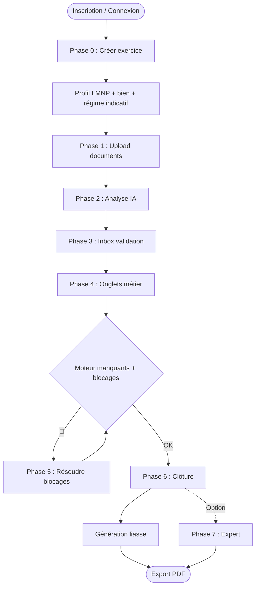
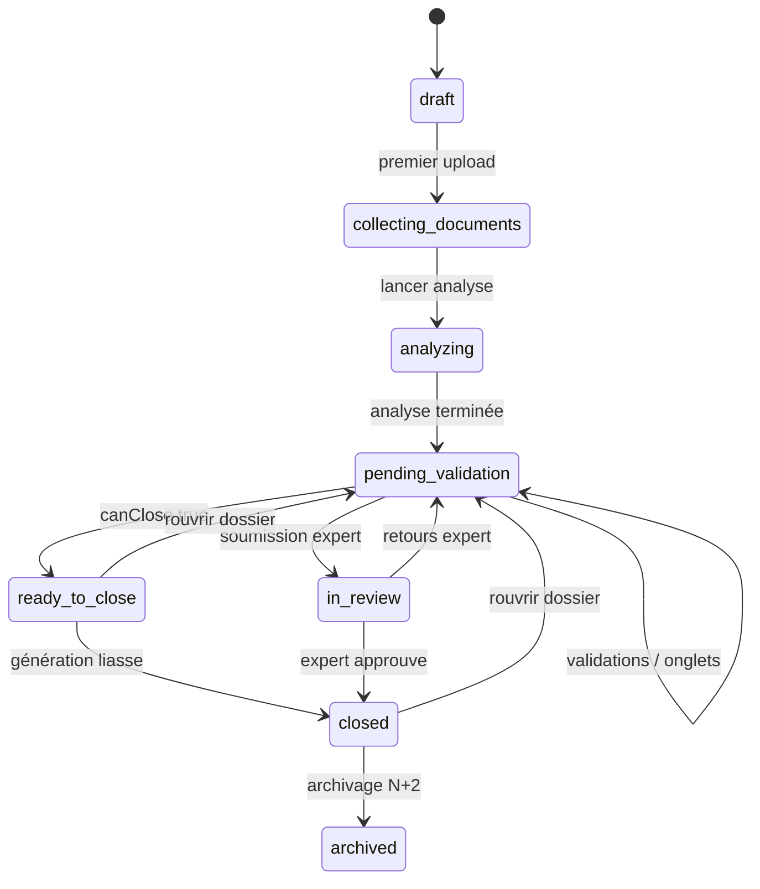

# Workflow & règles métier LMNP — Fiscal AI

> **Version** : 1.0  
> **Aligné avec** : [WIREFRAMES-LMNP.md](./WIREFRAMES-LMNP.md) · [DATA-MODEL-LMNP.md](./DATA-MODEL-LMNP.md)  
> **Public** : investisseurs LMNP **non comptables** — parcours simple, vocabulaire clair, blocages explicites et réversibles.

---

## 1. Objectifs du système de règles

| Objectif | Traduction produit |
|----------|-------------------|
| Guider sans submerger | Une **prochaine action** unique ; checklist courte |
| Anticiper les oublis | Moteur de **pièces manquantes** contextuel (régime, prêt, biens) |
| Ne jamais surprendre à la fin | Blocages visibles **dès** la collecte ; pas uniquement à la clôture |
| Rassurer | Niveaux de **confiance utilisateur** (santé du dossier) distincts de la confiance IA |
| Sécuriser juridiquement | Validation humaine obligatoire avant toute liasse exportable |

---

## 2. Workflow utilisateur complet

### 2.1 Les 7 phases (vue investisseur)

| Phase | Nom UI | Ce que l’utilisateur comprend | Statut `FiscalYear` |
|-------|--------|------------------------------|---------------------|
| 0 | **Créer mon exercice** | « Je démarre ma déclaration 2025 » | `draft` |
| 1 | **Envoyer mes documents** | « Je dépose mes papiers » | `collecting_documents` |
| 2 | **Analyse en cours** | « L’IA lit mes fichiers » | `analyzing` |
| 3 | **Vérifier les montants** | « Je confirme ce que l’IA a trouvé » | `pending_validation` |
| 4 | **Compléter mon dossier** | « Je remplis les onglets (loyers, charges…) » | `pending_validation` |
| 5 | **Corriger les points bloquants** | « Il manque X ou Y » | `pending_validation` → `ready_to_close` |
| 6 | **Clôturer & télécharger** | « Je génère ma liasse » | `ready_to_close` → `closed` |
| 7 | **Option expert** | « Un pro relit » (facultatif) | `in_review` |

Les phases 3–5 peuvent se chevaucher ; l’UI ne montre qu’**une priorité** à la fois (dashboard).

### 2.2 Diagramme de flux global



### 2.3 Parcours détaillé par écran

#### Phase 0 — Création exercice (≈ 3 min)

| Étape | Écran | Action utilisateur | Système |
|-------|-------|-------------------|---------|
| 0.1 | Dashboard vide | « Créer ma déclaration {année} » | Crée `FiscalYear` `draft` |
| 0.2 | Activité | Confirme LMNP, 1+ bien (adresse minimale) | Crée `Property`, checklist initiale |
| 0.3 | Activité | Indique régime **indicatif** (micro / réel) | `FiscalYear.regime` ; recalcule checklist |
| 0.4 | Documents ou Dashboard | Choix : « J’ai mes documents » / « Plus tard » | Redirection |

*Microcopy* : *« Vous pourrez changer d’avis sur le régime après avoir comparé — rien n’est envoyé aujourd’hui. »*

#### Phase 1 — Collecte documents (≈ 10–20 min)

| Étape | Écran | Action | Système |
|-------|-------|--------|---------|
| 1.1 | Documents | Drop multi-fichiers | `Document` + upload |
| 1.2 | Documents | Consulte checklist | `recomputeMissingDocuments()` |
| 1.3 | Documents | « Non applicable » sur une ligne | `ChecklistItemState.not_applicable` + motif |
| 1.4 | Documents | « Lancer l’analyse » (ou auto après upload) | → Phase 2 |

**Sortie de phase** : au moins 1 document uploadé **OU** checklist entièrement résolue (fourni + NA justifiés) pour tier **minimum**.

#### Phase 2 — Analyse IA (≈ 1–5 min)

| Étape | Écran | Action | Système |
|-------|-------|--------|---------|
| 2.1 | Progress / toast | Attend ou quitte | `DocumentAnalysis` pipeline |
| 2.2 | Notification | — | Crée `Extraction` + `ValidationItem` pending |
| 2.3 | Documents / Validation | — | `recomputeAlerts()` ; status → `pending_validation` |

**Sortie** : toutes analyses terminées (`analyzed` ou `failed`) ; CTA « Vérifier les montants ».

#### Phase 3 — Validation humaine (≈ 10–25 min)

| Étape | Écran | Action | Système |
|-------|-------|--------|---------|
| 3.1 | Validation inbox | Mode guidé ou liste | — |
| 3.2 | Focus | Approuve / Corrige / Ignore | `ValidationItem` → `LedgerEntry` si approuvé |
| 3.3 | Conflit | Compare sources | `Conflict` → résolution |
| 3.4 | Bulk | « Tout valider ≥ 95 % » (opt-in) | Batch approve **explicite** |

**Sortie** : `pendingValidationCount === 0` sur champs **obligatoires**.

#### Phase 4 — Onglets métier (≈ 15–40 min, parallèle)

Parcours **non imposé** ; ordre suggéré copilote :

1. Recettes  
2. Dépenses  
3. Emprunts (si prêt)  
4. Immobilisations (si réel)  
5. Activité (confirmation régime)

| Action | Système |
|--------|---------|
| Saisie manuelle ligne | `ValidationItem` auto-approved + `LedgerEntry` |
| Corriger champ validé | Void + nouvelle version |
| Joindre facture à une charge | Upload → extraction → validation |

#### Phase 5 — Blocages (durée variable)

| Étape | Écran | Action |
|-------|-------|--------|
| 5.1 | Alertes / Dashboard | Traite chaque 🔴 |
| 5.2 | Documents | Upload pièce manquante |
| 5.3 | Validation / onglets | Complète champ obligatoire |

**Sortie** : `canClose === true` (voir § 5).

#### Phase 6 — Clôture (≈ 5 min)

| Étape | Écran | Action | Système |
|-------|-------|--------|---------|
| 6.1 | Clôture | Lit verrou qualité | Affiche checklist finale |
| 6.2 | Clôture | « Générer ma liasse » | `LedgerSnapshot` + `TaxReturn` |
| 6.3 | Succès | Télécharge PDF | `closed` |

#### Phase 7 — Expert (optionnel)

Soumission → `in_review` → expert approuve ou renvoie corrections → retour phase 3–5.

### 2.4 Parcours « investisseur pressé » (happy path ~ 45 min)

```
Créer exercice → Upload 8–12 docs → Analyse → Valider inbox (mode guidé)
→ Parcourir Dépenses + Emprunts → Résoudre 0–1 🔴 → Clôturer
```

### 2.5 Parcours « investisseur prudent » (multi-session)

```
Session 1 : Phase 0–1 (documents)
Session 2 : Phase 2–3 (validation)
Session 3 : Phase 4 (onglets)
Session 4 : Phase 5–6 (blocages + clôture)
```

Le dashboard reprend à la **prochaine action** calculée.

### 2.6 Machine à états `FiscalYear` (technique)



---

## 3. Documents obligatoires & facultatifs

### 3.1 Niveaux d’exigence

| Niveau | Code | Signification UI | Impact clôture |
|--------|------|------------------|----------------|
| **Indispensable** | `required` | « Nécessaire pour clôturer » | 🔴 si absent et pas NA |
| **Recommandé** | `recommended` | « Fortement conseillé » | 🟡 alerte, pas de blocage |
| **Facultatif** | `optional` | « Utile si vous l’avez » | Aucun |
| **Conditionnel** | `conditional` | Dépend du contexte (prêt, régime…) | 🔴 si condition vraie |

### 3.2 Matrice par régime (1 bien, LMNP classique)

| DocumentType | Catégorie UI | Micro-BIC | Réel | Notes investisseur |
|--------------|--------------|-----------|------|-------------------|
| `lease_contract` | Bail | Recommandé | **Indispensable** | Preuve location meublée |
| `rent_receipt` | Bail / loyers | Facultatif | Recommandé | Contrôle mensuel |
| `rent_bank_statement` | Revenus | Recommandé | **Indispensable** | Total loyers annuel |
| `bank_statement` | Revenus | Facultatif | Recommandé | Si pas de relevé loyers dédié |
| `property_tax` | Charges | Facultatif | **Indispensable** | Taxe foncière |
| `insurance_invoice` | Charges | Facultatif | Recommandé | PNO |
| `condo_charges` | Charges | Facultatif | Recommandé | Si copropriété |
| `works_invoice` | Charges | — | Recommandé | Travaux déductibles |
| `furniture_invoice` | Immob. | — | Recommandé | Mobilier amortissable |
| `notary_deed` | Immob. | Facultatif | Recommandé | Prix acquisition / bâti |
| `loan_interest_certificate` | Emprunt | **Conditionnel** | **Conditionnel** | Si intérêts > 0 |
| `loan_schedule` | Emprunt | Facultatif | Recommandé | Croise attestation |
| `prior_year_return` | Fiscal | Facultatif | Recommandé | Déficits / amort. reportés |
| `cfe_invoice` | Autre | Facultatif | Facultatif | — |
| `unknown` | — | — | — | À classer par l’utilisateur |

### 3.3 Conditions contextuelles

| Condition | Documents deviennent `required` |
|-----------|----------------------------------|
| `FiscalYear.regime === "reel"` | Bail, relevé loyers, taxe foncière |
| `LedgerEntry` ou pending `loan.annualInterest` > 0 | `loan_interest_certificate` |
| `Property` en copropriété (flag utilisateur) | `condo_charges` → **recommended** (pas blocking par défaut) |
| Multi-biens (`propertyIds.length > 1`) | Règles **par bien** ; checklist dupliquée |
| Première année d’activité | `notary_deed` → recommended |
| Reprise déficit / amort. reporté (flag) | `prior_year_return` → recommended |

### 3.4 « Non applicable » (NA)

L’investisseur peut marquer une ligne checklist **NA** avec :

- Motif prédéfini : `no_loan` \| `no_condo` \| `not_owner_tax` \| `other`
- Texte libre si `other` (min. 10 caractères)

| Règle | Comportement |
|-------|--------------|
| NA sur doc **conditional** dont condition fausse | OK — retire exigence |
| NA sur doc **required** sans condition | **Interdit** sauf règles métier explicites (liste blanche § 3.5) |
| NA abusif détecté | Alerte 🟡 `A04` variant « Vérifier NA » + copilote |

### 3.5 Liste blanche NA autorisés (required → NA)

| DocumentType | Motif NA autorisé |
|--------------|-------------------|
| `loan_interest_certificate` | `no_loan` |
| `condo_charges` | `no_condo` |
| `property_tax` | Uniquement micro-BIC (pas de déduction) — avec warning |

### 3.6 Registre checklist (référence implémentation)

```typescript
interface DocumentRequirementRule {
  id: string;
  documentType: DocumentType;
  level: "required" | "recommended" | "optional" | "conditional";
  regimes: ("micro-bic" | "reel")[];
  /** Expression simplifiée — évaluée par le moteur */
  when?: RequirementCondition;
  naAllowed: boolean;
  naMotifs?: string[];
  userLabel: string;
  userHint: string;
}

type RequirementCondition =
  | { type: "has_loan" }
  | { type: "regime"; value: "reel" }
  | { type: "field_positive"; fieldKey: FieldKey }
  | { type: "property_flag"; flag: "condo" }
  | { type: "and"; conditions: RequirementCondition[] }
  | { type: "or"; conditions: RequirementCondition[] };
```

---

## 4. Moteur de détection des documents manquants

### 4.1 Responsabilité

Le moteur répond à trois questions **sans jargon** :

1. **Qu’est-ce qui manque ?** (liste lisible)
2. **Est-ce bloquant ?** (🔴 / 🟡 / rien)
3. **Que faire ?** (CTA : Ajouter · Non applicable · Ignorer pour l’instant)

Nom interne : `MissingDocumentsEngine`  
Entrée : `FiscalYear` + contexte · Sortie : `MissingDocumentReport`

### 4.2 Algorithme (idempotent)

```
function recomputeMissingDocuments(fiscalYearId):
  ctx = buildContext(fiscalYearId)
  rules = loadRulesFor(ctx.regime, ctx.properties)
  report = { items: [], blockingCount: 0, recommendedCount: 0 }

  for rule in rules:
    if not evaluateWhen(rule.when, ctx):
      continue

    satisfaction = evaluateSatisfaction(rule, ctx)

    report.items.push({
      ruleId: rule.id,
      documentType: rule.documentType,
      level: rule.level,
      status: satisfaction.status,  // missing | satisfied | not_applicable | waived
      blocking: satisfaction.blocking,
      suggestedActions: [...]
    })

    if satisfaction.blocking: report.blockingCount++

  upsertAlerts(A04, report)
  updateFiscalYearProgress(report)
  return report
```

### 4.3 Évaluation de satisfaction

Un document **satisfait** une règle si :

```typescript
function evaluateSatisfaction(rule, ctx): Satisfaction {
  // 1. NA explicite utilisateur
  const checklist = ctx.checklist.find(c => c.definitionId === rule.id);
  if (checklist?.status === "not_applicable") {
    return { status: "not_applicable", blocking: false };
  }

  // 2. Document présent et analysé (ou validé manuellement)
  const docs = ctx.documents.filter(d =>
    d.documentType === rule.documentType &&
    d.status !== "archived" &&
    !d.isDeleted
  );
  if (docs.some(d => d.status === "analyzed" || d.status === "uploaded")) {
    return { status: "satisfied", blocking: false };
  }

  // 3. Équivalence : autre type accepté (mapping)
  if (hasAcceptedEquivalent(rule.documentType, ctx)) {
    return { status: "satisfied", blocking: false };
  }

  // 4. Manquant
  const blocking = rule.level === "required" ||
    (rule.level === "conditional" && evaluateWhen(rule.when, ctx));

  return { status: "missing", blocking };
}
```

### 4.4 Équivalences (éviter faux manquants)

| Attendu | Accepté aussi |
|---------|---------------|
| `rent_bank_statement` | `bank_statement` si extraction `income.annualRent` validée |
| `rent_receipt` × 12 | `rent_bank_statement` annuel validé |
| `loan_interest_certificate` | `loan_schedule` si champ `loan.annualInterest` validé + cohérence |

Les équivalences **ne bloquent pas** mais peuvent générer 🟡 « Pièce recommandée absente ».

### 4.5 Contexte (`EngineContext`)

```typescript
interface EngineContext {
  fiscalYear: FiscalYear;
  properties: Property[];
  documents: Document[];
  checklist: ChecklistItemState[];
  ledgerEntries: LedgerEntry[];      // active only
  validationItems: ValidationItem[];
  conflicts: Conflict[];
  flags: {
    hasLoan: boolean;
    hasCondo: boolean;
    annualInterestCents: number;
    regime: "micro-bic" | "reel";
    propertyCount: number;
  };
}
```

`flags` dérivés des écritures validées **et** des déclarations utilisateur (phase 0).

### 4.6 Déclencheurs de recalcul

| Événement | Recalcul |
|-----------|----------|
| Upload / suppression document | Oui |
| Fin analyse document | Oui |
| Changement régime confirmé | Oui |
| NA checklist | Oui |
| Validation `loan.annualInterest` | Oui (peut exiger attestation) |
| Ajout/suppression bien | Oui |
| Clôture | Non (lecture seule sauf rouverture) |

### 4.7 Sortie UI (`MissingDocumentReport`)

```typescript
interface MissingDocumentReport {
  fiscalYearId: string;
  computedAt: string;
  items: MissingDocumentItem[];
  blockingCount: number;
  recommendedCount: number;
  overallDocumentsPercent: number;  // pour progression
}

interface MissingDocumentItem {
  ruleId: string;
  userLabel: string;               // « Attestation d'intérêts 2025 »
  userHint: string;
  level: "required" | "recommended" | "conditional";
  status: "missing" | "satisfied" | "not_applicable";
  blocking: boolean;
  propertyId?: string;
  primaryAction: "upload" | "mark_na" | "learn_more";
}
```

### 4.8 Exemple microcopy (liste manquants)

```
Il vous manque 2 pièces pour clôturer sereinement :

🔴 Attestation d'intérêts 2025
   Vous avez indiqué 4 680 € d'intérêts — ce document est nécessaire.
   [Ajouter le fichier]  [Je n'ai pas de prêt]

🟡 Facture assurance (PNO)
   Recommandé pour justifier votre charge « Assurance ».
   [Ajouter]  [Plus tard]
```

---

## 5. Règles de blocage

### 5.1 Définition

Un **blocage** empêche `canClose === true` et désactive le bouton « Générer ma liasse ».

### 5.2 Matrice de blocage (source unique)

| ID | Condition | Alerte | Message investisseur |
|----|-----------|--------|----------------------|
| B01 | `MissingDocumentReport.blockingCount > 0` | A04 | « Il manque une pièce indispensable » |
| B02 | ∃ `ValidationItem` où `isRequired && status === pending` | A07 | « Des montants attendent votre confirmation » |
| B03 | ∃ `Conflict` `open` sur champ obligatoire | A06 | « Deux documents ne donnent pas le même montant » |
| B04 | `loan.annualInterest` validé > 0 sans certificat / équivalent | A05 | « Ajoutez l'attestation de votre banque » |
| B05 | Champ obligatoire sans `LedgerEntry` active | A11 | « Information manquante : {label} » |
| B06 | `FiscalYear.regime` non confirmé | — | « Confirmez micro-BIC ou réel » |
| B07 | `Conflict` open sur champ obligatoire (doublon B03) | A02→A06 | Escalade si non résolu à J-0 clôture |
| B08 | Analyse en cours sur doc requis manquant non compensé | — | « Analyse non terminée » |

**Non bloquant** (🟡) : A01, A03, A09, A10, recommended manquants, A08.

### 5.3 Fonction `canClose`

```typescript
function canClose(ctx: EngineContext): CanCloseResult {
  const blockers: Blocker[] = [];

  if (ctx.missingDocs.blockingCount > 0)
    blockers.push({ code: "B01", ... });

  if (ctx.pendingRequiredValidations.length > 0)
    blockers.push({ code: "B02", ... });

  if (ctx.openConflictsOnRequiredFields.length > 0)
    blockers.push({ code: "B03", ... });

  if (ctx.flags.annualInterestCents > 0 && !ctx.hasLoanCertificate)
    blockers.push({ code: "B04", ... });

  for (const field of REQUIRED_FIELDS[ctx.flags.regime]) {
    if (!hasActiveLedgerEntry(ctx, field))
      blockers.push({ code: "B05", fieldKey: field });
  }

  if (!ctx.fiscalYear.regimeConfirmedAt)
    blockers.push({ code: "B06" });

  if (ctx.documents.some(d => d.status === "processing"))
    blockers.push({ code: "B08" });

  return {
    allowed: blockers.length === 0,
    blockers,
    warnings: computeWarnings(ctx),
  };
}
```

### 5.4 Champs obligatoires par régime (B05)

**Commun**

| fieldKey | Libellé UI |
|----------|------------|
| `fiscal.regime` | Régime fiscal |
| `property.address` | Adresse du bien |
| `income.annualRent` | Loyers perçus sur l'année |

**Réel uniquement**

| fieldKey | Libellé UI |
|----------|------------|
| `expense.propertyTax` | Taxe foncière (ou NA micro migré) |
| `amort.buildingAnnual` | Amortissement du bien |

**Conditionnel**

| fieldKey | Condition |
|----------|-----------|
| `loan.annualInterest` | Si `hasLoan` |

### 5.5 Ordre de résolution suggéré (copilote)

```
1. B02 validations pending (quick wins)
2. B03/B07 conflits
3. B01/B04 documents
4. B05 champs vides
5. B06 confirmation régime
```

---

## 6. Règles de validation finale (clôture)

### 6.1 Verrou qualité (écran Clôture)

Checklist affichée à l’utilisateur — chaque ligne ✅ / 🟡 / 🔴 :

| # | Contrôle | Règle |
|---|----------|-------|
| Q1 | Pièces indispensables | `blockingCount === 0` (moteur docs) |
| Q2 | Montants confirmés | 0 `ValidationItem` required pending |
| Q3 | Pas de conflit ouvert | 0 `Conflict.open` sur champs requis |
| Q4 | Onglets cohérents | Totaux onglets = somme `LedgerEntry` |
| Q5 | Régime confirmé | `regimeConfirmedAt` défini |
| Q6 | Amortissements (réel) | `amort.buildingAnnual` validé |
| Q7 | Emprunt (si applicable) | Certificat ou NA `no_loan` |
| Q8 | Simulation lue | Case « J'ai relu les totaux » (opt-in UX) |

Q8 n’est pas juridique — **renforce la confiance utilisateur**.

### 6.2 Pré-génération (serveur)

Avant `TaxReturn` :

```typescript
async function finalizeAndGenerate(fiscalYearId: string, userId: string) {
  const can = canClose(await buildContext(fiscalYearId));
  if (!can.allowed) throw new ClosureBlockedError(can.blockers);

  const snapshot = await createLedgerSnapshot(fiscalYearId);
  const forms = await computeForms(snapshot, regime);
  const taxReturn = await saveTaxReturn({ snapshotId: snapshot.id, forms });

  await setFiscalYearStatus(fiscalYearId, "closed");
  return taxReturn;
}
```

### 6.3 Post-génération

| Action | Règle |
|--------|-------|
| Télécharger PDF | Toujours si `closed` |
| Rouvrir dossier | Autorisé → status `pending_validation` ; `TaxReturn.version++` à regénération |
| Modifier après clôture | Crée alerte 💡 « Pensez à regénérer » |

### 6.4 Validation expert (option)

| Étape | Règle |
|-------|-------|
| Soumission | `canClose` doit être true |
| Revue | Expert peut flaguer champs → rouvre `ValidationItem` |
| Approbation | `TaxReturn.status = expert_approved` |

---

## 7. Niveaux de confiance

Deux systèmes **distincts** : confiance **IA** (technique) vs confiance **utilisateur** (ressenti + progression).

### 7.1 Confiance IA (extraction)

*Voir [DATA-MODEL-LMNP.md § 5](./DATA-MODEL-LMNP.md#5-niveaux-de-confiance-ia).*

| Bande | Score | Présentation non expert |
|-------|-------|-------------------------|
| Élevée | ≥ 95 % | « Lecture nette » — éligible validation groupée |
| Moyenne | 85–94 % | « À vérifier rapidement » |
| Faible | < 85 % | « Vérification conseillée en priorité » |

**Ne jamais afficher** : « Le montant est correct à 95 %. »  
**Toujours afficher** : « Nous sommes confiants à 95 % dans la lecture du document — confirmez le montant. »

### 7.2 Confiance utilisateur (santé du dossier)

Score **0–100** : `UserConfidenceScore` — indicateur unique header + dashboard.

#### Piliers (poids)

| Pilier | Poids | Mesure |
|--------|-------|--------|
| **Pièces** | 25 % | % règles `required`+`conditional` satisfaites |
| **Validations** | 35 % | % `ValidationItem` required approuvés |
| **Cohérence** | 20 % | 100 % − pénalités conflits / alertes 🟡 |
| **Complétude onglets** | 20 % | % champs obligatoires avec `LedgerEntry` |

```typescript
function computeUserConfidence(ctx: EngineContext): UserConfidenceScore {
  const documents = pillarDocuments(ctx);      // 0-100
  const validations = pillarValidations(ctx);  // 0-100
  const coherence = pillarCoherence(ctx);      // 0-100
  const tabs = pillarTabs(ctx);                // 0-100

  const score = Math.round(
    documents * 0.25 +
    validations * 0.35 +
    coherence * 0.20 +
    tabs * 0.20
  );

  return {
    score,
    level: scoreToLevel(score),
    pillars: { documents, validations, coherence, tabs },
    nextBoostAction: pickNextAction(ctx),
  };
}
```

#### Niveaux UX (`UserConfidenceLevel`)

| Score | Niveau | Couleur | Libellé UI | Signification pour l'investisseur |
|-------|--------|---------|------------|-----------------------------------|
| 0–24 | `starting` | Gris | « Démarrage » | « Commencez par ajouter vos documents » |
| 25–49 | `building` | Bleu | « En construction » | « Votre dossier prend forme » |
| 50–74 | `advancing` | Ambre | « Bon chemin » | « Encore quelques vérifications » |
| 75–89 | `almost_ready` | Vert clair | « Presque prêt » | « Vous pouvez préparer la clôture » |
| 90–100 | `ready` | Vert | « Prêt à clôturer » | *Uniquement si `canClose`* — sinon plafond 89 |

**Plafond** : si `canClose === false`, `score = min(score, 89)` — évite faux sentiment de fin.

### 7.3 Badges de réassurance (non numériques)

Affichés en complément du score :

| Badge | Condition |
|-------|-----------|
| « 🔒 Données privées » | Toujours |
| « ✅ {n} montants validés par vous » | `approvedValidations > 0` |
| « 📎 {n} justificatifs rattachés » | docs liés à écritures |
| « 👤 Dernière validation : vous, {date} » | Dernière action user |

### 7.4 Confiance par écran (indicateurs locaux)

| Écran | Indicateur |
|-------|------------|
| Documents | « Pièces : 86 % » |
| Validation | « {n} confirmations restantes » |
| Onglet Dépenses | « 4/5 catégories OK » |
| Clôture | Verrou Q1–Q8 |

### 7.5 Relation confiance IA → confiance utilisateur

| Événement | Impact UserConfidence |
|-----------|----------------------|
| Valide un montant faible confiance IA | +validations (fort) |
| Ignore un champ required | Plafond 49 max |
| Résout un conflit | +cohérence |
| Upload doc manquant 🔴 | +documents ; peut débloquer ready |

---

## 8. Synthèse des fonctions système

| Fonction | Entrée | Sortie | Déclencheur |
|----------|--------|--------|-------------|
| `recomputeMissingDocuments` | fiscalYearId | `MissingDocumentReport` | § 4.6 |
| `recomputeAlerts` | fiscalYearId | `Alert[]` | DATA-MODEL § 6.2 |
| `canClose` | context | `CanCloseResult` | Avant clôture |
| `computeUserConfidence` | context | `UserConfidenceScore` | Dashboard, header |
| `pickNextAction` | context | `NextAction` | Dashboard hero |
| `finalizeAndGenerate` | fiscalYearId | `TaxReturn` | Clic générer |

**Ordre d’appel recommandé** après tout changement :

```
buildContext → recomputeMissingDocuments → recomputeAlerts
            → computeUserConfidence → pickNextAction
```

---

## 9. Exemples scénarios investisseur

### Scénario A — Réel, 1 bien, prêt

1. Upload bail + relevé + TF + attestation banque.  
2. Moteur : 0 🔴 documents.  
3. Valide 6 propositions inbox.  
4. `UserConfidence` → 78 % (« Bon chemin »).  
5. Oublie assurance 142 € sans facture → A03 🟡, pas bloquant.  
6. Clôture OK → génère liasse.

### Scénario B — Micro-BIC, sans prêt

1. Checklist réduite : pas TF required, pas attestation.  
2. Marque NA sur condo et emprunt.  
3. Valide uniquement loyers.  
4. `canClose` avec moins d’étapes — parcours ~ 20 min.

### Scénario C — Blocage conflit

1. Bail 17 800 € vs banque 18 240 € → `Conflict` + A02.  
2. `UserConfidence` cohérence 60 %.  
3. Utilisateur choisit banque + note → conflit résolu → B03 levé.  
4. Score remonte à 82 %.

---

## 10. Glossaire investisseur (UI)

| Terme interne | Terme UI |
|---------------|----------|
| ValidationItem | « Montant à confirmer » |
| LedgerEntry | « Ligne enregistrée » |
| Conflict | « Deux chiffres différents » |
| Blocking | « Bloque la clôture » |
| Extraction | *(jamais affiché)* → « Proposition lue sur votre document » |
| UserConfidence | « Avancement de votre dossier » |

---

*Document vivant — toute modification des seuils ou checklist doit synchroniser DATA-MODEL (alertes), WIREFRAMES (copy) et tests d’acceptation `canClose`.*
